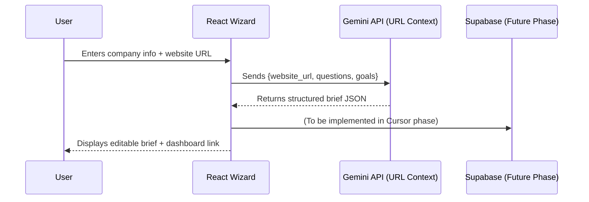

# 🎯 Prompt: **AI Brief Wizard MVP Plan (Frontend + AI Flow)**

**Goal:**
Create a **complete, production-ready MVP plan** for an **AI Brief Wizard** — a multi-step interface where potential clients answer guided questions, paste their website URL, and Gemini uses the **URL Context** feature to extract company insights and generate a structured **Project Brief**.

> **Important Note:**
> This plan should **NOT implement Supabase** directly.
> All Supabase database, RLS, and Edge Function work will be completed **in a separate Cursor engineering phase**.
> The focus here is on **the AI-driven flow, UX, screen structure, and integration points**, showing where the backend will later connect.

---

## 📘 Output Format (use Markdown)

The output should be clear, visual, and developer-friendly — include **tables**, **checklists**, and **Mermaid diagrams**.

---

### 1. **Executive Summary**

Briefly explain the purpose of the AI Brief Wizard MVP:

* Who it’s for (potential clients, startups, agencies).
* What it delivers (AI-assisted project brief creation from user answers + website scan).
* End goal: a dashboard with editable project briefs.

---

### 2. **How It Works (High-Level Flow)**

Provide a **Mermaid sequence diagram** describing this architecture:



Explain the data flow:

* User input → Gemini AI analysis → Structured brief returned → Stored later in Supabase (next phase).

---

### 3. **Screens & UX Plan**

Describe every MVP screen with goals, layout, and AI integration points:

| Screen                       | Purpose                                       | Key Elements                                  | AI / Backend Connection  | Success Criteria                     |
| :--------------------------- | :-------------------------------------------- | :-------------------------------------------- | :----------------------- | :----------------------------------- |
| **1. Welcome**               | Introduce the process and collect website URL | Company name, URL input, CTA                  | None (client-side only)  | Valid URL → Next step                |
| **2. Scope Builder**         | Capture project type, goals, and budget       | Chips, sliders, multi-select                  | None                     | Form data saved locally              |
| **3. AI Enrichment**         | AI scans website + generates summary          | Progress UI, “Analyzing…” status              | Gemini URL Context       | Returns valid project summary        |
| **4. Review Brief (Editor)** | User reviews AI-generated brief               | Rich text editor, “Regenerate” & “Save Draft” | (Future: Supabase call)  | Brief editable and autosaves locally |
| **5. Dashboard (Preview)**   | List of created briefs                        | Cards or table view                           | (Future: Supabase fetch) | Decks load from local cache          |

Also include a **Mermaid flowchart** showing screen navigation and user journey.

---

### 4. **Core AI Logic**

Focus on the **Gemini side only**:

* **Input:** `{company_name, website_url, project_type, goals, budget}`

* **Tools Used:** `urlContext`, `generateBriefOutline` (function call)

* **Expected Output (strict JSON):**

  ```json
  {
    "overview": "...",
    "key_goals": ["..."],
    "deliverables": ["..."],
    "tone": "Professional",
    "budget_band": "$25K–$50K",
    "summary_points": ["..."]
  }
  ```

* **Error Handling:**
  If Gemini fails, display retry UI or “Add info manually” prompt.

---

### 5. **UI Components (Frontend Only)**

List the minimal components to implement during MVP:

| Component                | Purpose                  | File Example                      | State           | Future Integration                |
| :----------------------- | :----------------------- | :-------------------------------- | :-------------- | :-------------------------------- |
| `UrlInput.tsx`           | Website input validation | `/components/UrlInput.tsx`        | Local state     | Send to AI                        |
| `ScopeForm.tsx`          | Capture goals & budget   | `/components/ScopeForm.tsx`       | Context         | Save draft                        |
| `AiGeneratingScreen.tsx` | Loading + AI output      | `/screens/AiGeneratingScreen.tsx` | Temporary JSON  | Will connect to `/generate-brief` |
| `BriefEditor.tsx`        | Editable AI summary      | `/screens/BriefEditor.tsx`        | Local state     | Future: Supabase sync             |
| `Dashboard.tsx`          | View saved briefs        | `/screens/Dashboard.tsx`          | Local mock data | Future: Supabase query            |

---

### 6. **AI Prompt Flow (Gemini Plan)**

Define clear prompt patterns for Gemini API:

**Prompt 1 — Analyze Website & Generate Brief**

> “Analyze this company website and return a structured project brief JSON including overview, goals, deliverables, and tone. Use facts only, no marketing fluff.”

**Prompt 2 — Improve or Rewrite Existing Brief**

> “Given this initial project brief, rewrite it for clarity and impact, preserving factual content.”

**Prompt 3 — Optional Visual Brief**

> “Return a JSON visual_brief (palette, style keywords, tone) to help design the project card.”

---

### 7. **MVP Task Tracker**

| Phase            | Task                                 | Responsible     | Output              | Status        | Success Criteria              |
| :--------------- | :----------------------------------- | :-------------- | :------------------ | :------------ | :---------------------------- |
| Design           | Create wireframes for all screens    | Gemini          | UI flow             | 🔴 0%         | Visual flow complete          |
| Frontend         | Implement Wizard & Dashboard layouts | Gemini + Cursor | Components          | 🔴 0%         | Responsive + navigable        |
| AI               | Test URL Context → JSON brief        | Gemini          | API response        | 🔴 0%         | Valid JSON every run          |
| Storage (Future) | Integrate Supabase                   | Cursor          | DB + Edge Functions | ⏸️ Next Phase | Decks persist across sessions |
| QA               | End-to-end local flow test           | Gemini          | Full demo           | 🔴 0%         | Smooth user journey           |

---

### 8. **Success Criteria (MVP)**

* AI always returns valid JSON output (100% structured).
* Wizard completes in <3 steps with minimal friction.
* User can paste website → get usable summary.
* No API keys exposed.
* Frontend ready for backend connection (hooks defined).

---

### 9. **Production Checklist (Frontend + AI Only)**

✅ Mobile & desktop layouts responsive
✅ Error handling for invalid URL / empty fields
✅ Loading & success states for AI output
✅ Local storage fallback for brief data
✅ Environment variables isolated (`VITE_GEMINI_KEY`)
✅ Clear placeholders for backend hooks

---

### 10. **Handoff Plan (to Cursor Phase)**

Add this clearly at the end:

> 🔹 **Next Engineering Phase — handled in Cursor:**
>
> * Implement Supabase database (profiles, briefs, revisions).
> * Add RLS + JWT-auth Edge Functions (`/generate-brief`, `/update-brief`).
> * Connect frontend screens to Supabase API.
> * Run RLS and end-to-end validation tests.

---

✅ **Expected Result:**
A detailed **MVP implementation plan** that fully defines the **frontend, AI logic, screens, and flow** for the **AI Brief Wizard**, clearly separating AI + UX work (Google Studio) from database + backend work (Cursor phase).