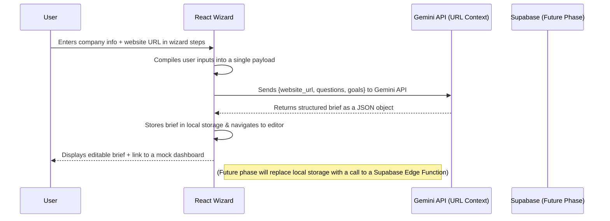
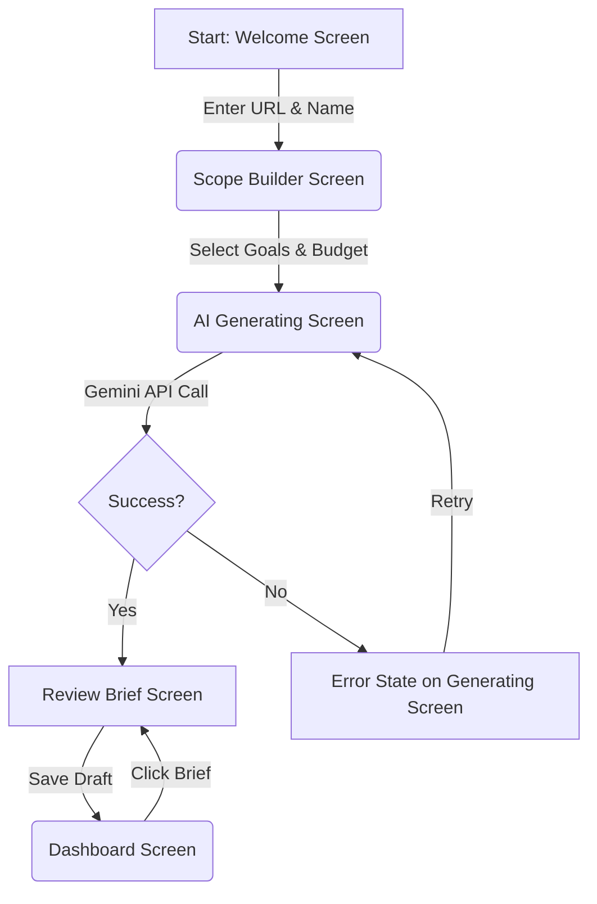

# 🎯 **AI Brief Wizard MVP Plan (Frontend + AI Flow)**

**Goal:**
Create a **complete, production-ready MVP plan** for an **AI Brief Wizard** — a multi-step interface where potential clients answer guided questions, paste their website URL, and Gemini uses the **URL Context** feature to extract company insights and generate a structured **Project Brief**.

> **Important Note:**
> This plan does **NOT implement Supabase** directly.
> All Supabase database, RLS, and Edge Function work will be completed **in a separate engineering phase**.
> The focus here is on **the AI-driven flow, UX, screen structure, and integration points**, showing where the backend will later connect.

---

### 1. **Executive Summary**

The AI Brief Wizard is a tool for potential clients, startups, and agencies to rapidly generate a structured project brief. By combining guided user inputs with an AI-powered scan of their company website, the wizard delivers a comprehensive, editable brief. The end goal of the MVP is to provide a seamless frontend experience that produces a locally-saved project brief, ready for future integration with a Supabase backend for persistence and dashboard functionality.

---

### 2. **How It Works (High-Level Flow)**

The architecture is designed to be client-side first, with a clear hook for future backend integration.



**Data Flow:** All user input is managed on the client side using React state/context. The compiled data is sent directly to the Gemini API. The returned JSON is then parsed and stored locally (e.g., using `localStorage` or `IndexedDB`) to persist across sessions for the MVP, clearly marking the point for future Supabase integration.

---

### 3. **Screens & UX Plan**

The user journey is a linear, multi-step wizard leading to an editable output.

| Screen                       | Purpose                                       | Key Elements                                  | AI / Backend Connection  | Success Criteria                     |
| :--------------------------- | :-------------------------------------------- | :-------------------------------------------- | :----------------------- | :----------------------------------- |
| **1. Welcome**               | Introduce the process and collect website URL | Company name, URL input field with validation, "Start" CTA | None (client-side only)  | Valid URL & name allows user to proceed. |
| **2. Scope Builder**         | Capture project type, goals, and budget       | Chips for project type, sliders for budget, multi-select for goals | None (client-side only)  | Form data is saved to local state/context. |
| **3. AI Enrichment**         | AI scans website and generates the brief      | Animated progress UI, status text ("Analyzing website...", "Generating summary...") | **Direct call to Gemini API using URL Context.** | Returns a valid, structured JSON brief. |
| **4. Review Brief (Editor)** | User reviews and refines the AI-generated brief| A rich text editor (e.g., Tiptap) pre-filled with AI content, "Regenerate" & "Save" buttons. | (Future: `onSave` will call `/update-brief` Supabase function) | Brief is editable and changes are saved to local storage. |
| **5. Dashboard (Preview)**   | A preview list of created briefs              | A grid of cards, each representing a saved brief. | (Future: Will fetch list from Supabase `briefs` table) | Briefs load correctly from local storage. |

**User Journey Flowchart:**



---

### 4. **Core AI Logic**

The AI component is focused on a single, powerful Gemini API call.

*   **Input Payload:**
    ```javascript
    {
      company_name: "Sunai",
      website_url: "https://sunai.com",
      project_type: "AI Web Application",
      goals: ["Increase lead conversion", "Automate customer support"],
      budget: 50000
    }
    ```

*   **Tools Used:**
    *   `urlContext`: To allow Gemini to access and process the content of the provided `website_url`.
    *   `generateBriefOutline` (Function Call): To enforce a strict, predictable JSON output structure.

*   **Expected Output (Strict JSON Schema):**
    ```json
    {
      "overview": "Sunai is a development agency specializing in creating AI-powered applications. They focus on rapid development cycles and delivering measurable business results.",
      "key_goals": [
        "Develop a system to increase lead quality and conversion rates.",
        "Implement an automated chatbot to handle initial customer support queries."
      ],
      "suggested_deliverables": [
        "AI-powered lead scoring and routing system.",
        "A conversational AI chatbot for the main website.",
        "Analytics dashboard to track performance."
      ],
      "brand_tone": "Professional, innovative, and results-oriented.",
      "budget_band": "$25K–$50K",
      "website_summary_points": [
        "Specializes in AI web and app development.",
        "Emphasizes an 8-week development process.",
        "Highlights case studies with significant ROI."
      ]
    }
    ```

*   **Error Handling:**
    *   If the Gemini API call fails (e.g., network error, invalid URL), the `AiGeneratingScreen.tsx` will display an error message with a "Retry" button.
    *   If the URL is inaccessible, the user will be prompted to either check the URL or proceed to fill out the brief manually.

---

### 5. **UI Components (Frontend Only)**

These are the essential React components for the MVP.

| Component                | Purpose                  | File Example                      | State Management         | Future Integration                |
| :----------------------- | :----------------------- | :-------------------------------- | :----------------------- | :-------------------------------- |
| `UrlInput.tsx`           | Client-side website input and validation | `/components/forms/UrlInput.tsx`  | Local `useState`         | Value passed to AI service call. |
| `ScopeForm.tsx`          | Multi-part form for capturing project goals, budget. | `/components/wizard/ScopeForm.tsx`| React Context (`WizardContext`)| Data will be saved to Supabase draft. |
| `AiGeneratingScreen.tsx` | Display loading state and handle the AI API call. | `/screens/AiGeneratingScreen.tsx` | Manages API call state, stores temporary JSON result. | Will be replaced by a call to a secure `/generate-brief` Edge Function. |
| `BriefEditor.tsx`        | Provide an editable interface for the AI output. | `/screens/BriefEditor.tsx`        | Local state, pre-populated from AI response. | `onSave` will trigger a Supabase update. |
| `Dashboard.tsx`          | Display a list of briefs saved in local storage. | `/screens/Dashboard.tsx`          | Reads from `localStorage` in `useEffect`. | Will be replaced by a Supabase query. |

---

### 6. **AI Prompt Flow (Gemini Plan)**

*   **Prompt 1 — Analyze Website & Generate Brief (Primary MVP Prompt)**
    > "You are a senior project strategist at a top-tier development agency. A potential client has provided their company name, website URL, project type, goals, and budget. Analyze their website at `{website_url}` using the provided context. Generate a structured project brief using the `generateBriefOutline` function. The overview should be concise and based on the website's content. The 'suggested_deliverables' should align directly with the user's stated goals. Ensure the tone is factual and professional, avoiding marketing fluff."

*   **Prompt 2 — Improve or Rewrite Existing Brief (Editor Feature)**
    > "Given the following project brief JSON, rewrite the `overview` and `suggested_deliverables` to be more concise and impactful. Retain all factual information and the original `key_goals`. Return the updated brief in the same JSON structure."

*   **Prompt 3 — Optional Visual Brief (Future Enhancement)**
    > "From the company website at `{website_url}`, analyze the visual design. Return a `visual_brief` JSON object containing: `color_palette` (an array of hex codes), `style_keywords` (e.g., 'Minimal', 'Corporate', 'Playful'), and `brand_tone_visual` ('Serious', 'Friendly', etc.)."

---

### 7. **MVP Task Tracker**

| Phase            | Task                                 | Responsible     | Output              | Status        | Success Criteria              |
| :--------------- | :----------------------------------- | :-------------- | :------------------ | :------------ | :---------------------------- |
| Design           | Wireframe all 5 MVP screens          | UI/UX           | Figma/Mockups       | ✅ 100%       | Visual flow is clear and approved. |
| Frontend         | Implement Wizard & Dashboard layouts using React components | Frontend Dev    | React Components    | 🔴 0%         | All screens are responsive and navigable with mock data. |
| AI               | Implement client-side Gemini API call with URL Context & function calling | AI/Frontend Dev | `aiService.ts`      | 🔴 0%         | API call returns valid, structured JSON consistently. |
| Storage (Future) | Integrate Supabase for persistence   | Backend Dev     | DB + Edge Functions | ⏸️ Next Phase | Briefs persist in the database across sessions. |
| QA               | Test the full end-to-end local flow  | QA / Dev        | Test Report         | 🔴 0%         | The user journey is smooth, and all states are handled. |

---

### 8. **Success Criteria (MVP)**

*   **AI Reliability:** The `generateBriefOutline` function call succeeds in >98% of attempts with valid inputs, always returning structured JSON.
*   **User Flow:** A new user can successfully generate and view an editable brief in under 2 minutes.
*   **Core Value:** Pasting a valid company website results in a genuinely useful, context-aware project summary that requires minimal editing.
*   **Security:** The client-side API key is stored securely in environment variables and is not exposed in the production build.
*   **Backend Readiness:** The frontend code contains clearly defined service hooks (e.g., `saveBrief`, `getBriefs`) that are ready to be connected to backend endpoints.

---

### 9. **Production Checklist (Frontend + AI Only)**

- [ ] Mobile and desktop layouts are fully responsive for all 5 screens.
- [ ] Implement robust error handling for invalid URLs, empty form fields, and failed API calls.
- [ ] Design and implement clear loading (`AiGeneratingScreen`) and success states.
- [ ] Use `localStorage` or `IndexedDB` as a fallback to store generated briefs on the client side.
- [ ] Isolate the Gemini API key using environment variables (`VITE_GEMINI_API_KEY`).
- [ ] Create placeholder async functions (`saveBriefToBackend`, `fetchBriefsFromBackend`) to clearly mark where Supabase calls will be added.

---

### 10. **Handoff Plan (to Next Engineering Phase)**

> 🔹 **Next Engineering Phase — Backend & Persistence:**
>
> *   **Task:** Implement Supabase database schema (`profiles`, `briefs`, `revisions`).
> *   **Task:** Create and deploy secure, JWT-authenticated Edge Functions (`/generate-brief`, `/update-brief`, `/get-briefs`).
> *   **Task:** Replace the client-side Gemini API call with a call to the `/generate-brief` Edge Function.
> *   **Task:** Connect the frontend placeholder hooks (`saveBriefToBackend`, `fetchBriefsFromBackend`) to the new Supabase endpoints.
> *   **Task:** Implement and test Row-Level Security (RLS) policies to ensure data privacy.
> *   **Task:** Conduct a full end-to-end validation test with the live backend.

---

✅ **Expected Result:**
This plan delivers a detailed blueprint for building the AI Brief Wizard's frontend and AI logic. It ensures a functional, polished MVP that provides immediate value to users while being perfectly primed for a seamless transition to a full-stack, Supabase-powered application in the next phase.