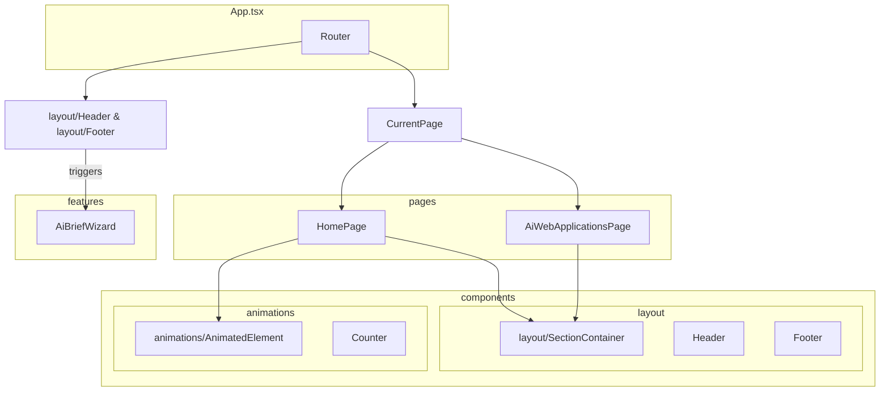

# Refactoring Plan: From Monolith to Modular App.tsx

**Document Status:** Published - 2024-08-19
**Author:** Senior Frontend Architect
**Goal:** To provide a safe, step-by-step plan for refactoring the monolithic `App.tsx` file into a modular, component-based architecture. This will significantly improve maintainability, scalability, and developer experience without altering existing functionality.

---

### 1. **Executive Summary**

The current `App.tsx` is a "god component"—a single, large file that contains the entire application's UI, logic, data, and pages. While effective for rapid prototyping, this structure is unsustainable for long-term development.

This plan outlines a structured process to dismantle `App.tsx` into a clean, organized, and professional codebase. By following these steps, we will create a system that is easier to debug, maintain, and scale, reducing the risk of bugs and accelerating future feature development.

---

### 2. **The Problem: A Monolithic Architecture**

-   **High Complexity:** `App.tsx` currently holds over 1,500 lines of code, mixing numerous concerns.
-   **Poor Maintainability:** A small change in one part of the file can have unintended and hard-to-trace side effects in another.
-   **Low Reusability:** Core components, hooks, and logic are not easily reusable in other parts of the application because they are not properly isolated.
-   **Collaboration Conflicts:** When multiple developers work on different features, they are forced to edit the same file, leading to frequent and complex merge conflicts.

---

### 3. **The Solution: A Professional, Modular Architecture**

We will adopt a standard, feature-driven React project structure that separates concerns logically.

#### **Proposed File Structure**

```
src/
├── App.tsx             # Main application shell and router
├── index.tsx           # Application entry point
├── components/         # Small, reusable UI components
│   ├── layout/         # Header.tsx, Footer.tsx, SectionContainer.tsx
│   └── animations/     # AnimatedElement.tsx, Counter.tsx
├── features/           # Self-contained feature modules
│   └── ai-brief-wizard/
│       └── AiBriefWizard.tsx
├── pages/              # Top-level page components
│   ├── HomePage.tsx
│   └── AiWebApplicationsPage.tsx
├── hooks/              # Custom React hooks
│   └── useOnScreen.ts
├── data/               # Application-wide constants and data
│   └── index.ts
├── types/              # TypeScript type definitions
│   └── index.ts
└── assets/             # SVGs, images, etc.
    └── icons.tsx       # All SVG icon components
```

#### **Visualizing the New Architecture**

This diagram shows how components will be organized and interact after the refactor. `App.tsx` becomes a simple orchestrator, delegating rendering to specialized page and feature components.



---

### 4. **The Refactoring Plan: A Safe, Step-by-Step Guide**

This process is designed to be performed incrementally. After each major step, **verify that the application still runs without errors** to catch issues early.

1.  **Preparation:**
    *   Create a new git branch: `feat/refactor-app-tsx`.
    *   Ensure the application is running and stable before starting.

2.  **Create the Directory Structure:**
    *   In your file explorer, create the new folders outlined in the architecture plan (`components`, `features`, `pages`, `hooks`, `data`, `types`, `assets`).

3.  **Migrate Primitives (The Foundation):**
    *   **Types:** Create `types/index.ts`. Cut all `type` and `interface` definitions from `App.tsx` and paste them here. Export each one. Update `App.tsx` to import them from the new file.
    *   **Data:** Create `data/index.ts`. Move all data constants (e.g., `NAV_LINKS`, `HOME_CORE_SERVICES`) into this file and export them. Update imports.
    *   **Icons:** Create `assets/icons.tsx`. Move all SVG icon components here, export them, and update imports.

4.  **Migrate Reusable Logic & Components:**
    *   **Hook:** Create `hooks/useOnScreen.ts`. Move the `useOnScreen` hook logic here.
    *   **Animation Components:** Create `components/animations/AnimatedElement.tsx` and `components/animations/Counter.tsx`. Move the component code into the respective files.
    *   **Layout Components:** Create files for `Header.tsx`, `Footer.tsx`, and `SectionContainer.tsx` inside `components/layout/`. Move the component code into each new file.

5.  **Isolate Major Features & Pages:**
    *   **AI Brief Wizard:** Create `features/ai-brief-wizard/AiBriefWizard.tsx`. Move the entire `AiBriefWizard` component and its related logic into this new file. This complex feature should be a self-contained module.
    *   **Pages:** Create `pages/HomePage.tsx` and `pages/AiWebApplicationsPage.tsx`. Move the corresponding page components into these files.

6.  **Final Cleanup of `App.tsx`:**
    *   After all migrations, `App.tsx` should be significantly smaller. Its sole responsibilities are:
        1.  Managing top-level state (`currentPage`, `isWizardOpen`).
        2.  Handling routing logic (the `renderPage` function).
        3.  Rendering the main layout (`Header`, `Footer`) and the current page.
    *   Review the file and remove all now-unused imports.

---

### 5. **Success Criteria**

The refactor will be considered a success when:

1.  **Zero Regressions:** The application's functionality is 100% identical to the pre-refactor version. All features work as expected.
2.  **Improved Structure:** The project's file structure matches the modular architecture defined in this plan.
3.  **Reduced Complexity:** The line count of `App.tsx` is reduced by at least 80%.
4.  **Enhanced Developer Experience:** The new structure is logical, making it significantly easier to locate code, fix bugs, and add new features.

---

### 6. **Production-Ready Checklist**

Before this branch can be merged, the following must be true:

- [ ] All new files have proper imports and exports, with no circular dependencies.
- [ ] The application has been manually tested end-to-end to confirm zero regressions.
- [ ] The `git diff` shows code being *moved* and *reorganized*, not functionally changed.
- [ ] The final `App.tsx` is lean and serves only as the application shell and router.
