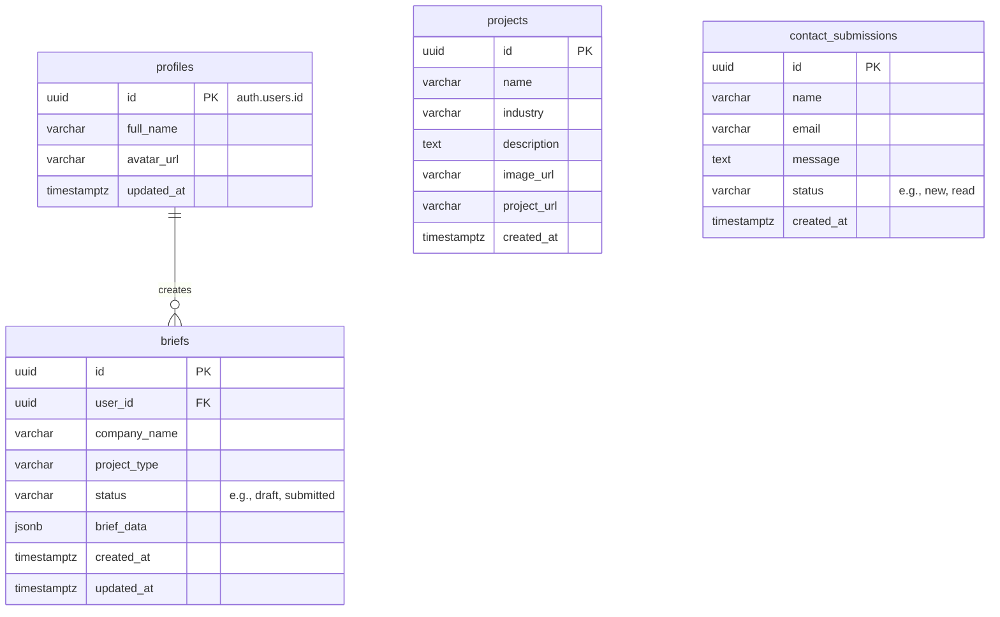
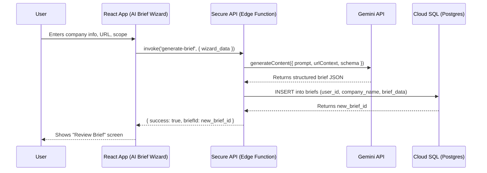

# 🗄️ Database Schema & Setup Plan: Sunai Agency Platform

**Document Status:** Published - 2024-08-19
**Author:** Senior Full-Stack Architect
**Goal:** To define a production-ready PostgreSQL schema for the Sunai agency website. This schema is designed to support user authentication and the core "AI Brief Wizard" feature for client project scoping and lead capture.

---

### 1. **System Analysis & Entity Design**

The primary goal of the application's data layer is to capture and store the project briefs generated by potential clients. The schema is therefore centered around users and their generated briefs.

-   **Users & Profiles:** To manage user accounts via Supabase Auth.
-   **Briefs:** The primary entity. Stores the structured JSON output from the AI Brief Wizard, linking it to the user who created it.
-   **Projects (Portfolio):** A table for the agency to showcase its own work on the `/projects` page. This is managed by administrators, not end-users.
-   **Contact Submissions:** A simple table to capture inquiries from the `/contact` page form.

---

### 2. **Entity Relationship Diagram (ERD)**

This diagram shows the simple, relational structure for the agency website.



---

### 3. **Dataflow Diagram: AI Brief Wizard**

This diagram illustrates the data flow for the core feature: generating a client brief.



---

### 4. **PostgreSQL Schema (Production Ready)**

This SQL script is designed for PostgreSQL 15+ and can be used as a migration file.

```sql
-- 20240819120000_init_agency_schema.sql
-- Sunai Agency Platform: Initial Database Schema

-- Enable necessary extensions
CREATE EXTENSION IF NOT EXISTS "pgcrypto";

-- -------------------------------------
-- Table: profiles
-- Stores public data for authenticated users.
-- -------------------------------------
CREATE TABLE public.profiles (
    id UUID NOT NULL PRIMARY KEY REFERENCES auth.users(id) ON DELETE CASCADE,
    full_name VARCHAR(255),
    avatar_url VARCHAR(255),
    updated_at TIMESTAMPTZ DEFAULT NOW()
);
COMMENT ON TABLE public.profiles IS 'Public profile information for each user.';

-- -------------------------------------
-- Table: briefs
-- Stores project briefs generated by users via the AI wizard.
-- -------------------------------------
CREATE TABLE public.briefs (
    id UUID PRIMARY KEY DEFAULT gen_random_uuid(),
    user_id UUID NOT NULL REFERENCES auth.users(id) ON DELETE CASCADE,
    company_name VARCHAR(255),
    project_type VARCHAR(100),
    status VARCHAR(50) NOT NULL DEFAULT 'draft', -- e.g., 'draft', 'submitted', 'in-review'
    brief_data JSONB,
    created_at TIMESTAMPTZ NOT NULL DEFAULT NOW(),
    updated_at TIMESTAMPTZ DEFAULT NOW()
);
CREATE INDEX idx_briefs_user_id ON public.briefs(user_id);
COMMENT ON TABLE public.briefs IS 'Stores AI-generated project briefs from clients.';

-- -------------------------------------
-- Table: projects (Agency Portfolio)
-- For admins to showcase completed work. Not user-editable.
-- -------------------------------------
CREATE TABLE public.projects (
    id UUID PRIMARY KEY DEFAULT gen_random_uuid(),
    name VARCHAR(255) NOT NULL,
    industry VARCHAR(100),
    description TEXT,
    image_url VARCHAR(255),
    project_url VARCHAR(255),
    display_order INT DEFAULT 0,
    is_featured BOOLEAN DEFAULT FALSE,
    created_at TIMESTAMPTZ NOT NULL DEFAULT NOW()
);
COMMENT ON TABLE public.projects IS 'Agency portfolio projects, managed by admins.';


-- -------------------------------------
-- Table: contact_submissions
-- Captures messages from the website's contact form.
-- -------------------------------------
CREATE TABLE public.contact_submissions (
    id UUID PRIMARY KEY DEFAULT gen_random_uuid(),
    name VARCHAR(255),
    email VARCHAR(255) NOT NULL,
    message TEXT NOT NULL,
    status VARCHAR(50) NOT NULL DEFAULT 'new', -- 'new', 'read', 'archived'
    created_at TIMESTAMPTZ NOT NULL DEFAULT NOW()
);
COMMENT ON TABLE public.contact_submissions IS 'Submissions from the contact form.';


-- Auto-update the `updated_at` timestamp on record change
CREATE OR REPLACE FUNCTION public.handle_updated_at()
RETURNS TRIGGER AS $$
BEGIN
    NEW.updated_at = NOW();
    RETURN NEW;
END;
$$ LANGUAGE plpgsql;

CREATE TRIGGER on_profiles_update BEFORE UPDATE ON public.profiles FOR EACH ROW EXECUTE PROCEDURE public.handle_updated_at();
CREATE TRIGGER on_briefs_update BEFORE UPDATE ON public.briefs FOR EACH ROW EXECUTE PROCEDURE public.handle_updated_at();

```

---

### 5. **Security: Row-Level Security (RLS) Policies**

These policies ensure that users can only access their own profile and briefs.

```sql
-- Enable RLS on user-specific tables
ALTER TABLE public.profiles ENABLE ROW LEVEL SECURITY;
ALTER TABLE public.briefs ENABLE ROW LEVEL SECURITY;

-- Policy: Users can view and manage their own profile.
CREATE POLICY "Users can manage their own profile."
ON public.profiles FOR ALL
USING (auth.uid() = id)
WITH CHECK (auth.uid() = id);

-- Policy: Users can view and manage their own generated briefs.
CREATE POLICY "Users can manage their own briefs."
ON public.briefs FOR ALL
USING (auth.uid() = user_id)
WITH CHECK (auth.uid() = user_id);

-- Note: The `projects` and `contact_submissions` tables are intended for admin access.
-- RLS can be applied here, but would typically rely on a custom claims role (e.g., 'admin')
-- or be handled via restrictive service_role keys in a Supabase environment.
```

---

### 6. **Google Cloud SQL Setup & Schema Import**

The process for setting up the instance remains the same.

**1. Create the Cloud SQL Instance**
```bash
# Set your project and desired region
export PROJECT_ID="your-gcp-project-id"
export REGION="us-central1"
export INSTANCE_NAME="sunai-agency-db-prod"

gcloud config set project $PROJECT_ID

gcloud sql instances create $INSTANCE_NAME \
    --database-version=POSTGRES_15 \
    --region=$REGION \
    --cpu=2 \
    --memory=4GB \
    --root-password="CHOOSE_A_STRONG_PASSWORD"
```

**2. Create the Database & User**
```bash
gcloud sql databases create sunai_agency_prod --instance=$INSTANCE_NAME
gcloud sql users create api_user --instance=$INSTANCE_NAME --password="CHOOSE_A_STRONG_PASSWORD"
```

**3. Import the Schema**
Save the SQL schema above to a file (e.g., `20240819120000_init_agency_schema.sql`) and import it.
```bash
# Start the Cloud SQL Auth Proxy in a separate terminal
./cloud-sql-proxy $PROJECT_ID:$REGION:$INSTANCE_NAME

# In another terminal, connect and import the schema
psql "host=127.0.0.1 port=5432 dbname=sunai_agency_prod user=api_user" \
    -f 20240819120000_init_agency_schema.sql
```

---

### 7. **Conclusion**

This revised schema is tailored specifically for the Sunai agency website. It provides a secure and scalable foundation for the core user journey—capturing high-quality project briefs—while providing clear, separate structures for administrative content like portfolio projects and contact form submissions. This is the correct foundation to build upon.