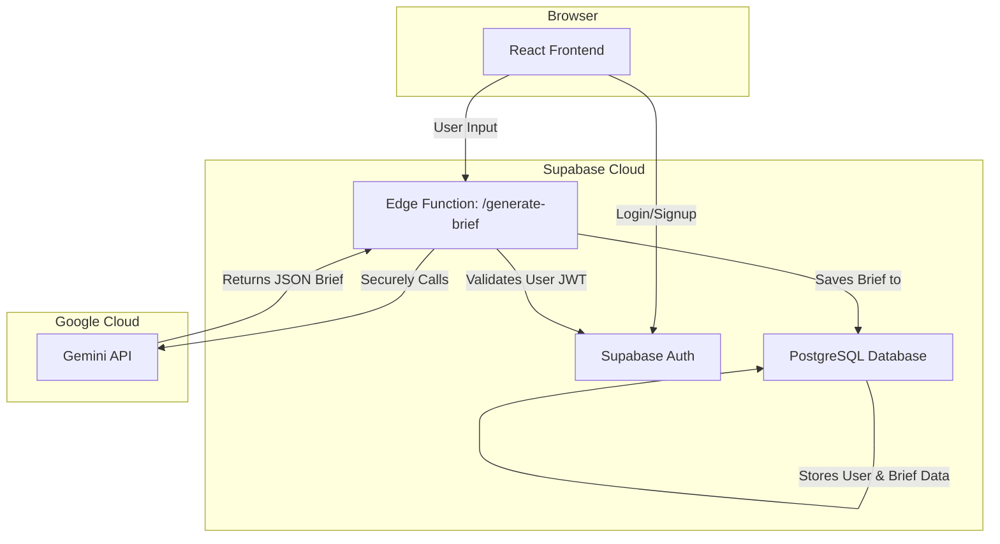

# 📄 Product Requirements Document (PRD): AI Brief Wizard

**Document Status:** Version 1.0 - Published
**Author:** Senior Full-Stack Engineer
**Goal:** To define the product, technical, and user experience requirements for transforming the AI Brief Wizard from a functional prototype into a secure, scalable, and production-ready lead-generation platform for Sunai.

---

## 1. Executive Summary

### 1.1. Product Purpose & Value
The **AI Brief Wizard** is an intelligent, interactive tool designed to streamline the initial project scoping process for potential Sunai clients. By guiding users through a series of questions and analyzing their existing company website, the wizard uses the Google Gemini API to instantly generate a structured, comprehensive project brief.

### 1.2. Problem Solved
Traditional client onboarding is often slow, manual, and prone to miscommunication. It requires multiple meetings and long email chains just to establish a baseline project scope. This creates friction for potential clients and consumes valuable time for the agency. The AI Brief Wizard solves this by automating the initial discovery phase, providing immediate value to the user and delivering a high-quality, pre-qualified lead to the Sunai team.

### 1.3. Target Audience
-   **Primary:** Startup Founders, Product Managers, and Marketing Leads who need to quickly scope a new AI-powered web or mobile application.
-   **Secondary:** Internal Sunai team (Sales, Project Managers) who will receive and act on the generated briefs.

---

## 2. System & Architecture Analysis

### 2.1. Current Setup
-   **Framework:** React 19 (SPA) with `react-router-dom` for navigation.
-   **Styling:** Tailwind CSS.
-   **AI Integration:** Direct client-side calls to the Google Gemini API (`@google/genai`) using the `gemini-2.5-flash` model.
-   **State Management:** Local React state (`useState`, `useCallback`).
-   **Backend & Database:** **None.** This is a critical gap. The application is currently a frontend-only prototype.

### 2.2. Production Architecture (Proposed)
The production version will adopt a secure, full-stack architecture powered by Supabase.

---

## 3. User Journeys

### 3.1. New Client Journey
1.  **Discovery:** A potential client lands on the Sunai website.
2.  **Initiation:** They click a "Start Your AI Brief" CTA.
3.  **Authentication (MVP):** They are prompted to sign up or log in to save their progress.
4.  **Wizard Step 1 (Welcome):** They enter their company name and website URL.
5.  **Wizard Step 2 (Scope):** They define their project type, goals, and budget.
6.  **Wizard Step 3 (Generation):** The system securely calls the Gemini API to generate the brief.
7.  **Wizard Step 4 (Review):** The user reviews the AI-generated brief.
8.  **Completion (MVP):** The user saves the brief, which becomes visible on their personal dashboard. The Sunai team is notified of the new lead.

### 3.2. Agency Admin Journey
1.  **Notification:** An admin receives a notification about a new brief submission.
2.  **Review:** They log into an admin dashboard (Advanced Feature).
3.  **Action:** They review the structured brief to understand the client's needs.
4.  **Engagement:** They initiate contact with the client with a clear understanding of the project, significantly reducing the sales cycle time.

---

## 4. Features Roadmap

### Phase 1: MVP — Secure & Persistent Brief Generation
The goal is to deliver the core value proposition in a secure, production-grade environment.

| Feature | Purpose & User Value | Tech Components | Success Criteria |
| :--- | :--- | :--- | :--- |
| **User Authentication** | Allow users to create accounts and save their briefs. | Supabase Auth, `profiles` table | Users can sign up, log in, and view their own data. |
| **Secure AI Generation**| Protect the Gemini API key and prevent abuse. | Supabase Edge Function (`/generate-brief`) | API key is 100% removed from the client. All AI calls are authenticated. |
| **Brief Persistence** | Save generated briefs to a user's account. | Supabase PostgreSQL (`briefs` table) | A user can refresh the page or log in later and still access their briefs. |
| **User Dashboard** | A central place for users to view their saved briefs. | New React page, Supabase DB query | Dashboard correctly lists all briefs belonging to the logged-in user. |
| **Static Pages** | Build out the remaining pages from the sitemap. | New React page components | Website has complete navigation and content for all core pages. |

### Phase 2: Advanced — Collaboration & Enrichment

| Feature | Purpose & User Value | Tech Components | Success Criteria |
| :--- | :--- | :--- | :--- |
| **Brief Editor** | Allow users to edit and refine their AI-generated brief. | Rich text editor (e.g., Tiptap), Supabase DB updates | Changes are saved in real-time. User can customize the brief. |
| **Brief Sharing** | Enable users to share a read-only link to their brief. | New `brief_shares` table, public-facing route | A public, shareable link can be generated for any brief. |
| **Admin Dashboard** | A portal for the Sunai team to review and manage briefs. | Admin UI, Supabase RLS with admin roles | Admins can view, sort, and filter all submitted client briefs. |
| **Multi-Source Input** | Allow users to upload documents (PDF, DOCX) as context. | Supabase Storage, Gemini File Search | The wizard can generate a brief from a user's business plan. |

### Phase 3: Automation — From Brief to Proposal

| Feature | Purpose & User Value | Tech Components | Success Criteria |
| :--- | :--- | :--- | :--- |
| **CRM Integration** | Automatically create leads in the company CRM. | Webhooks, Supabase Triggers, CRM API | A submitted brief automatically creates a new deal in HubSpot/Salesforce. |
| **Proposal Generation**| Generate a draft proposal document from a brief. | Gemini API, Document generation library | A PDF proposal can be generated with one click from the admin dashboard. |

---

## 5. Technical & Production Requirements

-   **Database:** A PostgreSQL database based on the schema in `docs/09-db-schema.md`.
-   **Authentication:** Supabase Auth with JWTs. Row-Level Security (RLS) must be enabled on all tables containing user data.
-   **API:** All client-server communication will go through Supabase Edge Functions. Inputs must be validated using a library like Zod.
-   **Hosting:** Frontend hosted on Vercel, backend on Supabase.
-   **Monitoring & Logging:** Vercel Analytics for user traffic, Supabase for database and function logs.
-   **Performance:** The `/generate-brief` endpoint should have a P95 response time of less than 15 seconds. The frontend should achieve a Lighthouse performance score of 90+.

---

## 6. Real-World Use Cases

1.  **Startup Founder Seeking Funding:** A founder with a live landing page needs a structured project scope to show potential investors. She uses the AI Brief Wizard, pastes her website URL, and in 90 seconds receives a downloadable brief outlining key deliverables, goals, and budget, which she includes in her pitch.
2.  **Marketing Manager Scoping a Project:** A manager at an established company is tasked with building an internal AI-powered tool. He uses the wizard to generate an initial brief. He then uses the "Edit" and "Share" features (Phase 2) to collaborate with his team and get internal buy-in before formally submitting it to Sunai.

---

## 7. Success Metrics & KPIs (MVP)

-   **User Engagement:**
    -   **Wizard Completion Rate:** > 60% of users who start the wizard successfully generate a brief.
    -   **User Retention:** > 20% of users return within 7 days.
-   **Business Value:**
    -   **Qualified Leads Generated:** > 10 per week.
    -   **Reduction in Sales Cycle:** 20% reduction in time from first contact to project start.
-   **System Performance:**
    -   **API Uptime:** > 99.9%.
    -   **Brief Generation Speed (P95):** < 15 seconds.
    -   **Security:** 0 incidents of unauthorized data access or API key exposure.