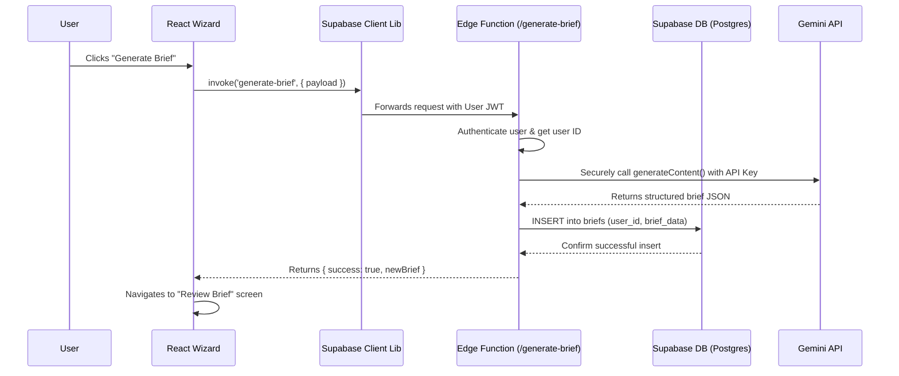

# 📝 Plan & Prompts: Building the `generate-brief` Edge Function

**Document Status:** Version 1.0 - Published
**Author:** Senior Full-Stack Architect
**Goal:** To provide a complete, step-by-step plan for creating, testing, and deploying the secure `generate-brief` Supabase Edge Function. This plan operationalizes the migration from a client-side prototype to a production-ready backend, resolving all critical security and data persistence issues.

---

### 1. **Executive Summary**

This document outlines the engineering tasks required to build the core of our application's backend. The `generate-brief` Edge Function will act as a secure proxy between our React client and the Gemini API. Its primary responsibilities are to:
1.  **Protect the Gemini API key** by moving all AI calls to the server.
2.  **Authenticate user requests** to prevent unauthorized use.
3.  **Persist the generated brief** into our Supabase PostgreSQL database.

Completing this plan is the most critical step toward making the AI Brief Wizard a secure, scalable, and production-ready feature.

---

### 2. **Architecture & Data Flow**

This diagram illustrates the final, secure workflow.

---

### 3. **Multi-Step Development Plan**

This plan should be executed in order to ensure a smooth implementation.

| Step | Task | Key Actions | Success Criteria |
| :--- | :--- | :--- | :--- |
| **1. Local Setup** | **Scaffold the Function & Set Secrets** | 1. Run `supabase functions new generate-brief`.   2. Create `supabase/.env.local`.   3. Add `GEMINI_API_KEY="your_key"` to the `.env.local` file.   4. Run `supabase start`. | The new function directory exists. Local Supabase stack is running without errors. |
| **2. Core Logic** | **Implement the Function's TypeScript Code** | 1. Add CORS and request handling logic.   2. Initialize Supabase client using the user's auth header.   3. Add logic to authenticate the user and return a 401 error if unauthorized.   4. Move Gemini API call logic from the frontend service to the function.   5. Add logic to `INSERT` the generated brief into the `briefs` table.   6. Implement comprehensive `try...catch` error handling. | The TypeScript code is complete, type-safe, and handles all steps of the data flow. |
| **3. Local Testing** | **Validate the Function Locally** | 1. Use `curl` or a REST client (e.g., Postman) to send a `POST` request to `http://localhost:54321/functions/v1/generate-brief`.   2. Include a valid user JWT in the `Authorization` header.   3. Verify the function returns a 200 OK and that a new record appears in the `briefs` table in the local Studio. | The function executes successfully with valid input and correctly fails with invalid/missing auth. |
| **4. Deployment** | **Deploy Secrets & Function** | 1. Set the production secret: `supabase secrets set GEMINI_API_KEY="your_prod_key"`.   2. Deploy the function: `supabase functions deploy generate-brief --no-verify-jwt`. | The function is live and visible in the Supabase project dashboard. |
| **5. Integration** | **Connect the Frontend** | 1. Refactor `services/aiService.ts` to remove the client-side Gemini call.   2. Update it to securely call the deployed Edge Function using `supabase.functions.invoke()`.   3. Refactor `AiBriefWizard.tsx` to handle the new async flow and response format. | The "Generate Brief" button in the UI now successfully triggers the Edge Function and receives the response. |

---

### 4. **AI-Assisted Multi-Step Prompts**

Use these prompts with an AI assistant (like Gemini Code Assist) to accelerate development of the function's code.

**Prompt 1: Basic Structure**
> /generate a Supabase Edge Function in TypeScript. It should handle a POST request, include CORS headers for OPTIONS pre-flight requests, and have a basic try-catch block for error handling.

**Prompt 2: User Authentication**
> /modify the previous function. Inside the `try` block, add logic to create a Supabase client using the `Authorization` header from the incoming request. Then, use that client to get the authenticated user's data. If there is no user, return a 401 Unauthorized error.

**Prompt 3: AI & Database Logic**
> /modify the previous function. After authenticating the user, add the following logic:
> 1. Parse the request body to get the wizard payload (`companyName`, `websiteUrl`, etc.).
> 2. Construct a prompt and call the Gemini API using a client initialized with a `GEMINI_API_KEY` from `Deno.env.get()`.
> 3. Parse the JSON response from the AI.
> 4. Use the Supabase client to `INSERT` a new record into the `briefs` table, including the `user.id` and the parsed AI data.
> 5. Return the newly created brief record to the client with a 200 OK status.

**Prompt 4: Full Production Code**
> /generate a complete, production-ready Supabase Edge Function named `generate-brief`. It must be written in TypeScript for the Deno runtime. The function must:
> 1. Handle CORS pre-flight requests.
> 2. Securely authenticate the user via their JWT from the Authorization header.
> 3. Get the Gemini API key from environment secrets.
> 4. Call the Gemini API (`gemini-2.5-flash` model with `googleSearch` tool) to generate a project brief from a website URL and user inputs.
> 5. Robustly parse the AI's JSON response, cleaning any markdown fences.
> 6. Insert the final brief into the `briefs` table in PostgreSQL, linking it to the authenticated user.
> 7. Return the newly created database record or a structured error message.
> Ensure all best practices for security and error handling are followed.

---

### 5. **Success Criteria**

The implementation will be considered a success when:
-   **Security:** The Gemini API key is 100% removed from the client-side code and is never exposed.
-   **Authentication:** The Edge Function correctly rejects any request that does not include a valid Supabase user JWT.
-   **Persistence:** A successful function call results in a new, correctly structured record being created in the `briefs` database table.
-   **Functionality:** The end-to-end flow, initiated from the frontend UI, works flawlessly and the user is correctly navigated to the review screen with the persisted data.
-   **Reliability:** The function correctly handles and logs errors from both the Gemini API and the database, returning appropriate error codes (401, 500) to the client.

---

### 6. **Production-Ready Checklist**

- [ ] **Secrets Management:** `GEMINI_API_KEY` is set in the production Supabase project and NOT in any committed code.
- [ ] **Input Validation:** (Optional but recommended) Add Zod or a similar library to validate the incoming request payload.
- [ ] **Error Handling:** The function has a root `try...catch` block and returns meaningful JSON error messages.
- [ ] **Authentication:** The user's JWT is being verified on every call.
- [ ] **CORS Policy:** The `corsHeaders` are correctly configured to allow requests from the production frontend domain.
- [ ] **Logging:** Add `console.log` statements for key events (e.g., function invoked, brief saved) to aid in debugging.
- [ ] **Staging Test:** The function has been deployed and tested against a staging version of the frontend before merging to production.

This plan provides a clear path to transforming our prototype's core feature into a secure, scalable, and production-grade backend service.
