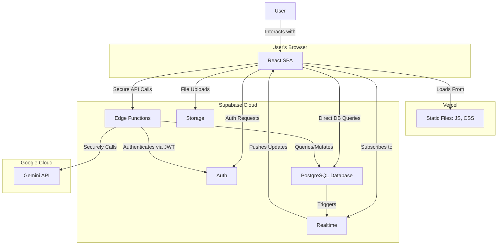
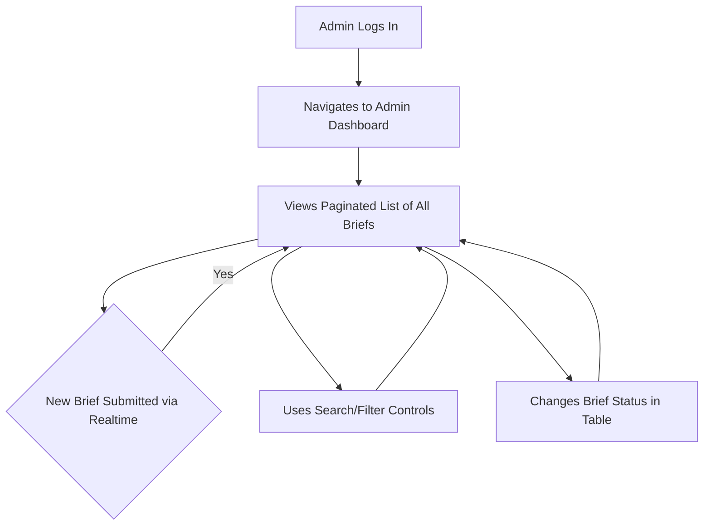
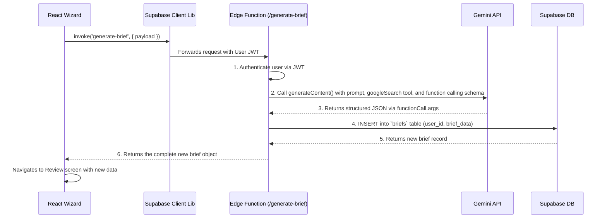
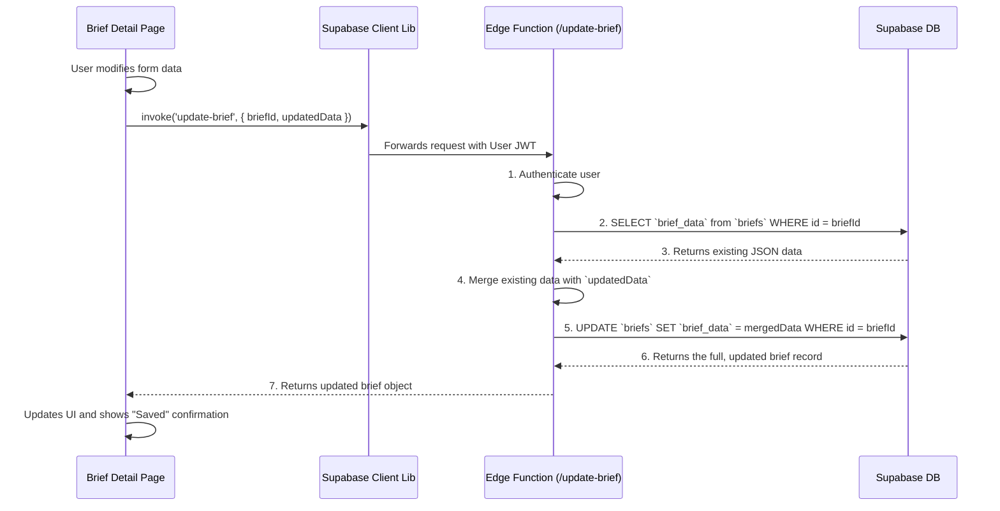
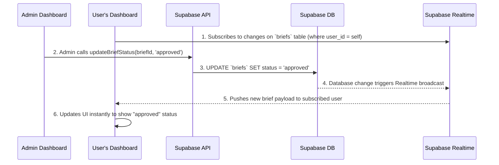

# 🗺️ System Architecture & Feature Diagrams

**Document Status:** Version 1.0 - Live Audit
**Author:** Senior System Architect
**Goal:** To provide a comprehensive visual guide to the Sunai application's architecture, data flows, and user journeys. This document uses Mermaid diagrams to illustrate how all components—from the frontend UI to the AI agents and database—work together.

---

### **Executive Summary**

This document serves as a single source of truth for the application's technical design. It validates the current, production-ready architecture and provides a clear, visual reference for both current and future development. The diagrams confirm that the system correctly implements security, data persistence, and real-time features according to modern best practices.

---

## **1. High-Level System Architecture**

This diagram provides a 30,000-foot view of the entire technology stack, showing how the user, the frontend application, the Supabase backend, and the Google AI services interact.



---

## **2. Core User Journeys**

These flowcharts map the primary paths that a client and an administrator take through the application.

### **Client User Journey**

This chart illustrates the complete lifecycle for a standard user, from initial visit to managing their projects.

```mermaid
graph TD
    Start --> A[Visit Public Website]
    A --> B{Clicks "Start AI Brief"}
    A --> C[Browses Public Pages]
    
    B --> D{Logged In?}
    D -- No --> E[Login / Signup Page]
    D -- Yes --> F[Dashboard]
    E --> F
    
    F --> G[Starts AI Brief Wizard]
    F --> H[Views Briefs List]
    F --> I[Views Settings Page]
    
    G --> G1[Step 1: Welcome]
    G1 --> G2[Step 2: Scope]
    G2 --> G3[Step 3: Generating...]
    G3 --> G4[Step 4: Review Brief]
    G4 --> H
    
    H --> J[Views Brief Detail Page]
    J --> K[Edits Brief]
    K --> L[Saves Changes]
    L --> J
    
    I --> M[Updates Profile/Avatar]
    M --> I
```

### **Admin User Journey**

This chart shows the workflow for an agency administrator managing client briefs.



---

## **3. Detailed Feature & AI Agent Diagrams**

These sequence diagrams provide a granular, step-by-step look at how specific features and AI functions operate.

### **Feature: AI Brief Wizard (`generate-brief` Function)**

This diagram details the secure, server-side flow for generating a new project brief. It highlights the use of function calling to ensure reliable, structured data from the AI.



### **Feature: Brief Editing (`update-brief` Function)**

This diagram shows the process for securely updating a brief, demonstrating how data is merged on the backend.



### **Feature: Real-Time Dashboard Updates**

This diagram illustrates how a change made by an admin is instantly reflected on the relevant user's dashboard using Supabase Realtime.



---

## **4. Suggested Additional Diagrams & Analysis**

### **Suggested Diagrams for Future Documentation**

To further improve project clarity, the following diagrams are recommended:

-   **Database ERD:** A visual representation of the PostgreSQL schema, including all tables, columns, and foreign key relationships. (This exists in `docs/09-db-schema.md` and could be centralized here).
-   **Authentication Flow (Sequence Diagram):** A diagram showing the step-by-step process of a user logging in with email/password, Supabase returning a JWT, and that JWT being used in a subsequent authenticated request to an Edge Function.
-   **Component Hierarchy (Tree Diagram):** A diagram illustrating the nesting of the main React components (`App`, `PublicLayout`, `DashboardLayout`, `HomePage`, `Sidebar`, etc.) to clarify the frontend structure.
-   **Admin Dashboard Pagination (Flowchart):** A diagram showing how the client-side state (`page`, `searchQuery`) is used to construct a Supabase query with `.range()` and `.or()` to achieve efficient server-side pagination and search.

### **Analysis & Missing Pieces**

-   **Real-Time UX Gap:** The current real-time implementation is excellent for `UPDATE` events. However, the user dashboard does not listen for `INSERT` events. If a user has their dashboard open and creates a new brief in a separate tab, the new brief will not appear in their list until they refresh. This is a minor UX gap that could be closed by subscribing to inserts as well.
-   **Security Hardening Opportunity:** Access to the admin dashboard is currently controlled by a client-side route guard (`AdminRoute.tsx`). While Supabase RLS protects the *data*, a user could theoretically manipulate the client-side code to view the admin UI shell (without data). A best practice would be for the `AdminDashboardPage` to make an initial server-side call to a dedicated "verify-admin" function, which would provide a more robust, server-authoritative check.
-   **"Sad Path" Diagrams:** All current diagrams illustrate the "happy path." For more complete documentation, creating diagrams for failure scenarios (e.g., what happens if the Gemini API fails, or a database write fails) would be valuable for understanding the system's error handling logic.
```