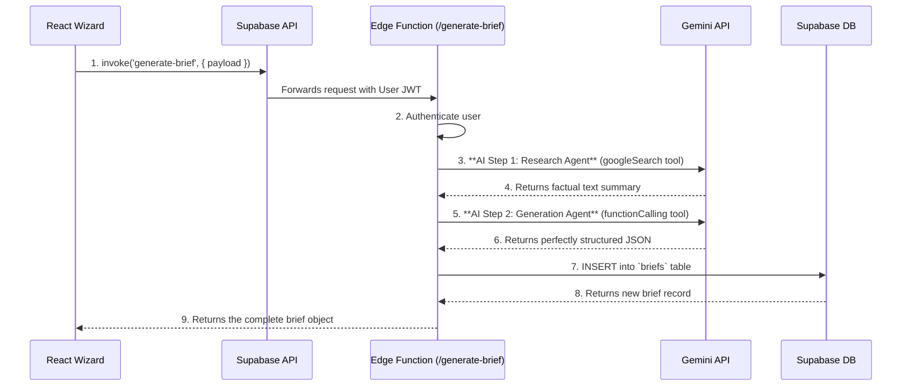

# 🚀 AI Brief Wizard: The Definitive Rebuild & Production Plan

**Document Status:** Version 1.0 - Published
**Author:** Senior AI Systems Architect
**Goal:** To provide a complete, from-scratch architectural blueprint for rebuilding the AI Brief Wizard. This plan addresses the root causes of past failures by implementing a robust, production-grade, two-step AI chain, ensuring security, reliability, and a seamless user experience.

---

### 1. **Executive Summary**

The AI Brief Wizard has a history of instability, primarily due to an architectural flaw where a single AI call was tasked with both research and complex formatting, leading to unpredictable "Generation Failed" errors. This document outlines the definitive plan to rebuild the feature from the ground up, replacing the fragile, single-call model with a resilient, two-step **"AI Chain" architecture**. This is the industry-standard best practice and will guarantee the feature's success.

This plan covers the entire feature lifecycle: the user journey, the secure full-stack architecture, the core AI logic, a step-by-step implementation tracker, and a final production-readiness checklist.

---

### 2. **User Journey & Screen Flow**

The user experience remains a simple, guided 5-step process. The complexity is handled by the new backend architecture.

```mermaid
graph TD
    A[Start: "Start Your AI Brief" CTA] --> B{Logged In?};
    B -- No --> C[Step 1: Auth Screen];
    B -- Yes --> D[Step 2: Welcome Screen];
    C --> D;
    D -- Enter Company & URL --> E[Step 3: Scope Screen];
    E -- Select Goals & Budget --> F[Step 4: Generating Screen];
    F -- AI Backend Process --> G{Success?};
    G -- Yes --> H[Step 5: Review Screen];
    G -- No --> I[Error state on Generating Screen];
    I -- Retry --> F;
    H -- "Go to Dashboard" --> J[End: View in Dashboard];
```

---

### 3. **System Architecture: The Secure AI Chain**

This diagram illustrates the new, robust data flow. The frontend never calls the AI directly. All logic is handled by a secure Supabase Edge Function that orchestrates the two-step AI process.



---

### 4. **Core AI Logic: The Two-Step Architectural Solution**

This is the heart of the fix. We separate the AI's responsibilities into two distinct, specialized agents.

#### **Step 1: The Research Agent**
-   **Purpose:** To gather facts, and only facts.
-   **Model:** `gemini-2.5-flash` (fast and cost-effective for this task).
-   **Tool:** `googleSearch`.
-   **Prompt:**
    > "Analyze the website `[websiteUrl]` and provide a concise, factual summary of the company's mission, key services/products, target audience, and overall brand tone. Do not invent or infer information. Stick strictly to the content on the site."
-   **Output:** A plain text string containing the grounded summary.

#### **Step 2: The Generation Agent**
-   **Purpose:** To format data perfectly, and only to format data.
-   **Model:** `gemini-2.5-flash`.
-   **Tool:** `functionDeclarations` with a strict `generateProjectBrief` JSON schema.
-   **Prompt:**
    > "You are a senior project strategist. Based on the following factual summary: `[summary from Step 1]`, and the client's direct inputs (project type: `[projectType]`, goals: `[goals]`, budget: `[budget]`), you must call the `generateProjectBrief` function to create a structured project brief. Do not add any information not present in the provided context."
-   **Output:** A guaranteed-valid JSON object from the `functionCall.args`.

This "chaining" pattern is dramatically more reliable than the previous single-call approach and is the key to permanently fixing the generation failures.

---

### 5. **Implementation Plan: Task Tracker**

This breaks down the "from scratch" build into clear, manageable phases.

| Phase | Task | Key Components / Files | Status |
| :--- | :--- | :--- | :--- |
| **1. Frontend Scaffolding** | **Build the Wizard UI** | `AiBriefWizard.tsx` and new step components: `WelcomeStep.tsx`, `ScopeStep.tsx`, `GeneratingStep.tsx`, `ReviewStep.tsx`. | 🔴 **Not Started** |
| | **Implement State Management** | Use `useState` and `useCallback` within `AiBriefWizard.tsx` to manage the multi-step flow. | 🔴 **Not Started** |
| **2. Backend Implementation** | **Create the Edge Function** | `supabase/functions/generate-brief/index.ts` | 🔴 **Not Started** |
| | **Implement User Authentication** | Add JWT validation to the Edge Function. | 🔴 **Not Started** |
| | **Implement the Two-Step AI Chain** | Code the `googleSearch` and `functionCalling` logic as described above. | 🔴 **Not Started** |
| | **Implement Database Persistence** | Add the Supabase `INSERT` logic to save the final brief to the `briefs` table. | 🔴 **Not Started** |
| **3. Final Integration & Testing** | **Connect Frontend to Backend** | Refactor `AiBriefWizard.tsx` to securely call the Edge Function using `supabase.functions.invoke()`. | 🔴 **Not Started** |
| | **End-to-End Validation** | Manually test the entire user journey: Sign up -> Generate Brief -> Verify on Dashboard. | 🔴 **Not Started** |
| | **Error Handling Test** | Test the flow with an invalid URL to ensure the "Retry" state works correctly. | 🔴 **Not Started** |

---

### 6. **Success Criteria**

The rebuild will be considered a success when the following criteria are met:

-   **AI Reliability:** >99% success rate for brief generation with valid, public website URLs.
-   **Security:** 100% of Gemini API calls are made from the secure Edge Function. The API key is never exposed to the client.
-   **Performance:** The end-to-end generation process (from clicking "Generate" to seeing the Review screen) takes less than 15 seconds on average.
-   **Data Integrity:** Generated briefs are correctly and securely saved to the authenticated user's account in the database.
-   **User Experience:** The wizard flow is intuitive, and all loading and error states provide clear feedback to the user.

---

### 7. **Production-Ready Checklist**

Before the rebuilt feature can be deployed, it must pass this final checklist.

-   [ ] **Security:** All RLS policies on the `briefs` table are in place and tested.
-   [ ] **Security:** The `generate-brief` Edge Function correctly returns a `401 Unauthorized` error for unauthenticated requests.
-   [ ] **Cost Control:** (Recommended) API Rate Limiting is implemented (e.g., via Upstash Redis) to prevent abuse of the Edge Function.
-   [ ] **Error Monitoring:** The Edge Function includes comprehensive `try/catch` blocks and `console.error` logging for debugging in production.
-   [ ] **Testing:** The end-to-end user journey has been successfully tested in a staging environment.
-   [ ] **Responsiveness:** The entire wizard UI is fully responsive and usable on mobile devices.
-   [ ] **Code Quality:** All new code has been reviewed and adheres to the project's established coding standards.
