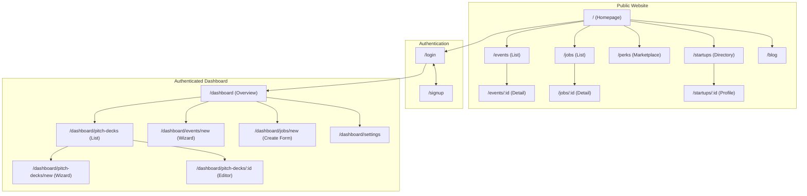

# 🚀 Sun AI: Full-Stack Architecture Blueprint

**Document Status:** Version 1.0 - Published
**Author:** Senior Full-Stack Architect
**Goal:** To provide a single source of truth for the architectural design of the Sun AI platform. This document outlines the best practices for folder structure, routing, backend services, and AI integration to build a scalable, secure, and maintainable application from scratch.

---

## 1. Executive Summary

This blueprint defines a modern, production-grade architecture for the Sun AI platform. The core principles are **speed, security, and scalability**.

-   **Frontend:** A performant React (Vite) single-page application with a clear, component-based structure.
-   **Backend:** A secure and scalable Supabase backend, where all sensitive operations and AI calls are handled by serverless Edge Functions.
-   **Architecture:** A clear separation of concerns between the client (presentation) and the server (business logic), ensuring a clean and maintainable codebase.

**Analogy:** Think of this architecture like a well-designed restaurant. The **frontend** is the beautiful, user-friendly dining area. The **backend** is the secure, efficient kitchen where all the complex work happens. The **API** is the waiter, taking orders and delivering food without letting customers into the kitchen.

---

## 2. Final Recommended Folder Structure

This structure separates concerns, making the codebase easy to navigate and scale.

```
sun-ai/
├── public/
│   ├── favicon.svg
│   └── ... (other static assets)
├── src/
│   ├── App.tsx                 # Main app component with router setup
│   ├── main.tsx                # Application entry point
│   ├── index.css               # Global styles & Tailwind imports
│   │
│   ├── assets/                 # Images, fonts, etc.
│   │
│   ├── components/
│   │   ├── ui/                 # Re-exported shadcn/ui components (Button, Card, etc.)
│   │   └── shared/             # App-specific shared components (e.g., StatCard, UserAvatar)
│   │
│   ├── features/               # Large, self-contained feature modules
│   │   ├── pitch-deck-wizard/  # All components, hooks, and logic for this wizard
│   │   └── event-wizard/
│   │
│   ├── hooks/                  # Custom React hooks (e.g., useDebounce, useAuth)
│   ├── layout/                 # Main layout components
│   │   ├── PublicLayout.tsx    # Layout for marketing pages (Header, Footer)
│   │   └── DashboardLayout.tsx # Layout for authenticated app (Sidebar, Header)
│   │
│   ├── lib/                    # Shared libraries and clients
│   │   ├── supabase.ts         # Supabase client instance
│   │   └── utils.ts            # General utility functions
│   │
│   ├── pages/
│   │   ├── public/             # All public-facing marketing pages
│   │   │   ├── HomePage.tsx
│   │   │   └── EventsPage.tsx
│   │   └── dashboard/          # All pages requiring authentication
│   │       ├── OverviewPage.tsx
│   │       └── pitch-decks/
│   │           ├── PitchDecksListPage.tsx
│   │           └── PitchDeckDetailPage.tsx
│   │
│   ├── routes/
│   │   └── index.tsx           # Main AppRoutes component
│   │
│   ├── services/               # Frontend data-fetching functions (typed wrappers for Supabase)
│   │   ├── eventService.ts
│   │   └── pitchDeckService.ts
│   │
│   └── types/                  # Global TypeScript type definitions
│       └── index.ts
│
└── supabase/
    ├── functions/
    │   ├── _shared/            # Reusable Deno modules (clients, validation, prompts)
    │   │   ├── geminiClient.ts
    │   │   └── prompts/
    │   │       └── pitchDeckPrompts.ts
    │   ├── generate-pitch-deck/
    │   │   └── index.ts
    │   └── generate-event-image/
    │       └── index.ts
    ├── migrations/             # Database schema changes
    └── seed.sql                # Initial data for local development
```

---

## 3. Frontend Architecture

### 3.1. Routing Plan

We will use **layout-based routing** with `react-router-dom`. This is a clean pattern that separates public pages from the authenticated dashboard.

```tsx
// src/routes/index.tsx

<Routes>
  {/* Public pages with marketing Header/Footer */}
  <Route element={<PublicLayout />}>
    <Route path="/" element={<HomePage />} />
    <Route path="/events" element={<EventsPage />} />
    <Route path="/jobs" element={<JobsPage />} />
  </Route>

  {/* Authenticated dashboard pages with Sidebar/DashboardHeader */}
  <Route element={<AuthGuard><DashboardLayout /></AuthGuard>}>
    <Route path="/dashboard" element={<OverviewPage />} />
    <Route path="/dashboard/pitch-decks" element={<PitchDecksListPage />} />
    <Route path="/dashboard/events/new" element={<EventWizardPage />} />
  </Route>
  
  <Route path="/login" element={<LoginPage />} />
</Routes>
```

-   **Code Splitting:** All page components will be lazy-loaded using `React.lazy()` to ensure fast initial load times.
-   **Auth Guard:** An `<AuthGuard>` component will protect dashboard routes, redirecting unauthenticated users to the `/login` page.

### 3.2. Component Architecture

-   **`src/components/ui`:** This is where you will place components generated by `shadcn/ui`. They are unstyled, foundational building blocks.
-   **`src/components/shared`:** These are your application's custom, styled components that are used in multiple places (e.g., a styled `<StatCard>` that uses shadcn's `<Card>` component internally).
-   **`src/features`:** A feature folder contains everything needed for a complex piece of functionality. For example, `src/features/pitch-deck-wizard/` would contain all the components for each step of the wizard (`Step1.tsx`, `Step2.tsx`), the main wizard component, and any specific hooks (`usePitchDeckWizard.ts`). This makes the feature self-contained and easy to manage.

### 3.3. State Management
-   **Local/Component State:** For simple UI state (e.g., toggles, form inputs), use `useState`.
-   **Shared State:** For global state like the currently logged-in user, use `React.Context`.
-   **Server State:** For fetching, caching, and mutating data from Supabase, use a dedicated library like **TanStack Query (React Query)**. This is a best practice that simplifies loading/error states and improves performance.

---

## 4. Backend Architecture (Supabase)

### 4.1. Database Schema & RLS

-   **Schema:** The database will be organized into clear, relational tables (e.g., `users`, `startups`, `pitch_decks`, `events`, `jobs`). All schema changes must be managed through migration files in `supabase/migrations/`.
-   **Row-Level Security (RLS):** RLS is the cornerstone of our security model. It must be **enabled on all tables with user data**.
    -   **Analogy:** RLS is like giving every user a key that only opens their own apartment door. Even if they know the address of their neighbor's apartment, their key won't work.
    -   **Example Policy:**
        ```sql
        -- Users can only see their own pitch decks.
        CREATE POLICY "Enable read access for own decks"
        ON pitch_decks FOR SELECT USING (auth.uid() = user_id);
        ```

### 4.2. Supabase Storage

Storage will be organized into buckets with strict RLS policies.

-   `profile-avatars/`:
    -   Policy: Publicly readable, but a user can only upload/update files in a folder matching their `user_id` (e.g., `profile-avatars/{user_id}/avatar.png`).
-   `pitch-deck-assets/{deck_id}/`:
    -   Policy: Not public. A user can only access files if they are the owner of the `deck_id`.

### 4.3. Edge Functions (API Boundary)

Edge Functions are our secure "back office."

-   **Reads vs. Writes:**
    -   **Read Operations (SELECT):** Can be done directly from the frontend using `supabase-js`, as RLS provides sufficient security.
    -   **Write Operations (INSERT, UPDATE, DELETE):** **MUST** go through an Edge Function. This allows for server-side validation and prevents users from writing arbitrary data to the database.
    -   **AI Calls:** All calls to the Gemini API **MUST** be in an Edge Function to protect the API key.

-   **Example Function (`/generate-pitch-deck`):**
    1.  Receives a request from the frontend with user input.
    2.  Authenticates the user via their JWT.
    3.  Fetches a prompt template from `_shared/prompts/`.
    4.  Calls the Gemini API (`gemini-2.5-pro` with function calling for structured JSON).
    5.  Validates the AI's response.
    6.  Inserts the new pitch deck into the database.
    7.  Returns the new deck's ID to the frontend.

---

## 5. AI Integration Plan

-   **Security:** The `GEMINI_API_KEY` will be stored **only** as a Supabase secret. It will never be exposed to the frontend.
-   **Organization:**
    -   `supabase/functions/_shared/geminiClient.ts`: A shared utility to initialize the Gemini client.
    -   `supabase/functions/_shared/prompts/`: A folder to store prompt templates as TypeScript files. This keeps prompts separate from business logic and makes them easier to manage and version control.
-   **Model Usage:**
    -   **`gemini-2.5-pro`:** For tasks requiring high-quality, structured JSON output (e.g., generating the initial pitch deck structure using function calling).
    -   **`gemini-flash`:** For faster, less complex tasks (e.g., rewriting a single slide, generating headline variations).
    -   **`gemini-2.5-flash-image`:** For generating slide background images from text prompts.

---

## 6. Website & Dashboard Sitemap

This diagram illustrates the full sitemap, separating public and authenticated sections.



---

## 7. Golden Path User Journey

This is the primary, high-value flow for a new founder using the platform.

1.  **Discover:** A founder lands on the **Homepage (`/`)** and learns about Sun AI.
2.  **Engage:** They click "Create Your Pitch Deck" and are taken to the **Signup page (`/signup`)**.
3.  **Onboard:** After signing up, they are redirected to the **Pitch Deck Wizard (`/dashboard/pitch-decks/new`)**.
4.  **Create:** The founder provides their startup details. The app calls the secure `/generate-pitch-deck` Edge Function, which uses Gemini to create a structured deck.
5.  **Edit:** The founder is redirected to the **Deck Editor (`/dashboard/pitch-decks/:id`)**, where they can refine the AI-generated content and use other AI tools (e.g., generate images for slides).
6.  **Manage:** They return to their main **Dashboard (`/dashboard`)**, where they see their newly created pitch deck listed.

---

## 8. Production Best Practices

-   **Performance:**
    -   **Lazy Loading:** All routes must be lazy-loaded.
    -   **Caching:** Use TanStack Query to cache Supabase data on the frontend, reducing unnecessary API calls.
    -   **Database Indexes:** Add indexes to columns that are frequently used in `WHERE` clauses (e.g., `user_id`, `status`).
-   **Security:**
    -   **RLS is mandatory.**
    -   **Environment Variables:** Use `VITE_` prefix for public frontend variables. All secret keys must be stored as Supabase secrets.
    -   **Input Validation:** Use a library like Zod in Edge Functions to validate all incoming request bodies.
-   **Developer Experience:**
    -   **Linting/Formatting:** Enforce ESLint and Prettier from day one.
    -   **Path Aliases:** Configure `tsconfig.json` with a `@/*` alias for `src/*` to simplify import paths.
    -   **Logging:** Use Supabase's built-in logging for Edge Functions. For the frontend, integrate a service like Sentry or LogRocket for error monitoring.
```