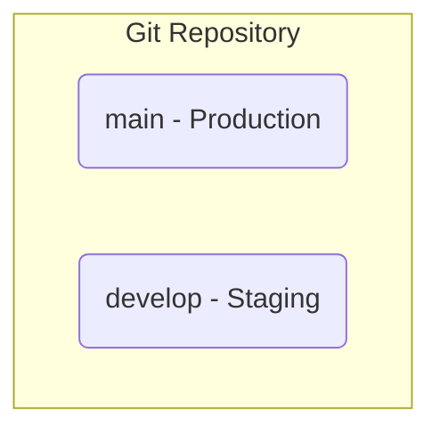
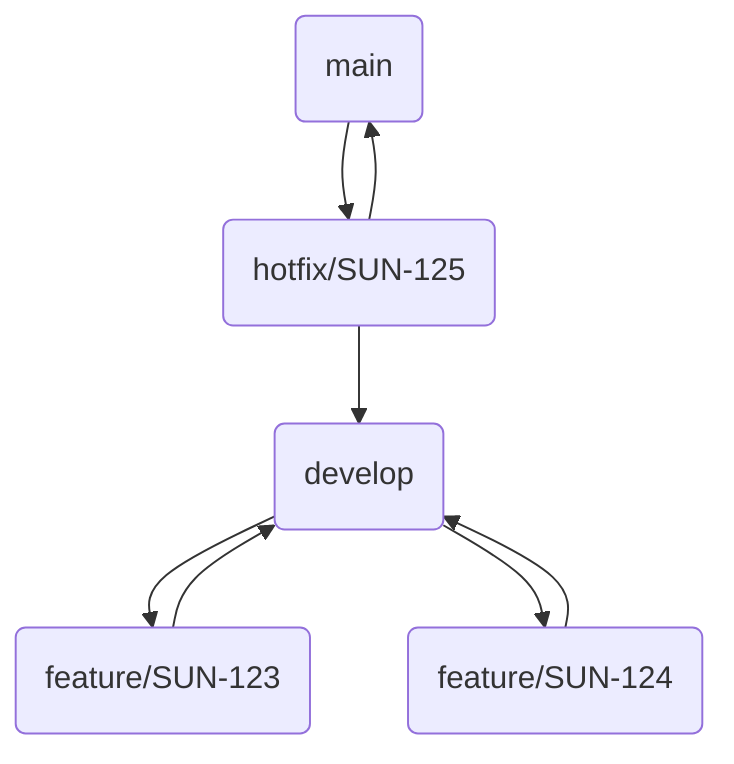

# 🌿 Git Workflow & Branching Strategy: Sun AI

**Version:** 1.0  
**Status:** Published  
**Author:** Senior Project Architect  
**Goal:** To define a standardized Git workflow that ensures code quality, prevents merge conflicts, and provides a clear, predictable process for developing, testing, and releasing new features.

---

## 1. Core Principles

-   **Stability:** The `main` branch must always be stable and deployable.
-   **Clarity:** Branch names and commit messages should be clear and descriptive.
-   **Traceability:** It should be easy to trace any code change back to a specific task or feature.

## 2. Main Branches

Our workflow uses two primary, long-lived branches:

-   `main`:
    -   **Purpose:** This branch represents the **production-ready** code. It is the single source of truth for what is currently live for users.
    -   **Rules:**
        -   Direct commits to `main` are **strictly forbidden**.
        -   Code only gets into `main` by merging from the `develop` branch during a release.

-   `develop`:
    -   **Purpose:** This is the primary integration branch for all new features. It represents the "next release" and should always be in a stable, buildable state.
    -   **Rules:**
        -   Features are merged into `develop` after they are complete and have been code-reviewed.
        -   This branch is deployed to our **Staging** environment for QA testing.



## 3. Supporting Branches (Temporary)

These branches are used for day-to-day development and have a limited lifetime.

### 3.1. Feature Branches (`feature/...`)

-   **Purpose:** To develop a new feature.
-   **Branching:** Branched off `develop`.
-   **Naming Convention:** `feature/<ticket-id>-<short-description>`
    -   **Example:** `feature/SUN-123-add-pitch-deck-wizard`
-   **Workflow:**
    1.  Create the feature branch from `develop`.
    2.  Work on the feature, making small, atomic commits.
    3.  Once the feature is complete and tested locally, open a **Pull Request (PR)** to merge it into `develop`.
    4.  After the PR is approved and passes all CI checks, it is merged.
    5.  The feature branch is then deleted.

### 3.2. Hotfix Branches (`hotfix/...`)

-   **Purpose:** To fix a critical bug in production.
-   **Branching:** Branched off `main`.
-   **Naming Convention:** `hotfix/<ticket-id>-<fix-description>`
    -   **Example:** `hotfix/SUN-125-fix-login-button-bug`
-   **Workflow:**
    1.  Create the hotfix branch from `main`.
    2.  Implement and test the fix.
    3.  Open a PR to merge the hotfix into **both `main` and `develop`** to ensure the fix is applied to both production and the next release.
    4.  After merging, the hotfix branch is deleted.



## 4. The Pull Request (PR) Process

A Pull Request is the gateway for all code entering `develop` or `main`.

-   **PR Title:** Must be clear and concise.
    -   **Format:** `<Type>: <Short Description> (SUN-XXX)`
    -   **Types:** `feat`, `fix`, `docs`, `style`, `refactor`, `test`, `chore`.
    -   **Example:** `feat: Add Pitch Deck Wizard (SUN-123)`

-   **PR Description:**
    -   Use a PR template.
    -   Clearly describe **what** the change is and **why** it's being made.
    -   Include screenshots or GIFs for any UI changes.
    -   Link to the relevant ticket (e.g., in Jira or Linear).

-   **Review Process:**
    1.  At least **one** other developer must review and approve the PR.
    2.  All automated checks (CI build, tests, linting) **must pass**.
    3.  The reviewer is responsible for checking for code quality, correctness, and adherence to the style guide.
    4.  Once approved, the author can merge the PR. Use a **"Squash and Merge"** strategy to keep the `develop` branch history clean.

## 5. Commit Message Guidelines

-   Follow the [Conventional Commits](https://www.conventionalcommits.org/en/v1.0.0/) specification.
-   **Format:** `<type>(<scope>): <subject>`
    -   **Example:** `feat(wizard): add welcome step form validation`
-   **Why?** This creates a clean, readable commit history and allows us to automate changelog generation.

## 6. Full Workflow Example: New Feature

1.  **Get a ticket:** `SUN-123: Add Pitch Deck Wizard`.
2.  **Create a branch:**
    ```bash
    git checkout develop
    git pull origin develop
    git checkout -b feature/SUN-123-add-pitch-deck-wizard
    ```
3.  **Develop:** Write code, make commits.
    ```bash
    git commit -m "feat(wizard): add multi-step layout"
    git commit -m "feat(wizard): implement welcome step UI"
    ```
4.  **Push and Open PR:**
    ```bash
    git push -u origin feature/SUN-123-add-pitch-deck-wizard
    ```
    -   Go to GitHub and open a PR against the `develop` branch.
5.  **Review & Merge:**
    -   A teammate reviews the code and approves it.
    -   CI checks pass.
    -   You click "Squash and Merge".
6.  **Clean up:** Delete the feature branch.

---

This workflow provides a balance of structure and flexibility, enabling the team to move quickly while maintaining a high standard of quality and a stable production environment.