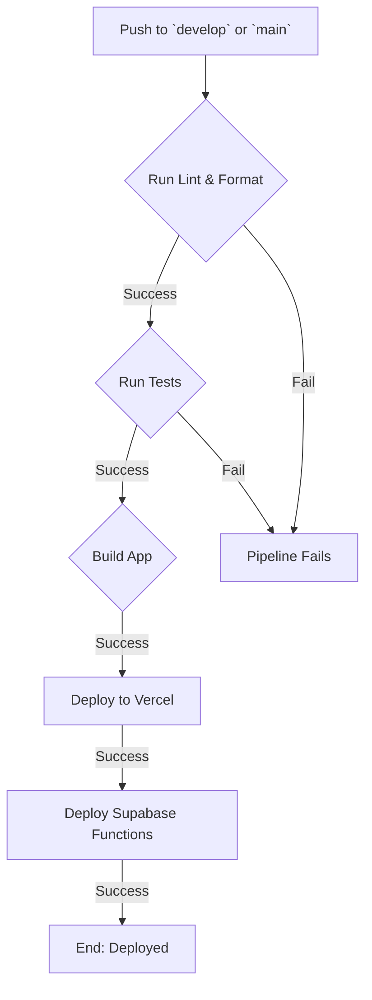

# 🚀 Deployment & CI/CD Strategy: Sun AI

**Version:** 1.0  
**Status:** Published  
**Author:** Senior DevOps Architect  
**Goal:** To define a clear, automated, and secure strategy for deploying the Sun AI application across multiple environments, ensuring stability and rapid release cycles.

---

## 1. Environment Strategy

We will use a three-environment model, which is the industry standard for professional web applications. This isolates development from production and allows for safe testing.

| Environment | Purpose | Supabase Project | Frontend Host | Deployed From |
| :--- | :--- | :--- | :--- | :--- |
| **Development** | Local developer machines. | Local Docker instance via Supabase CLI. | `localhost` via Vite dev server. | N/A |
| **Staging** | QA testing, stakeholder reviews, pre-production validation. | `sun-ai-staging` | `staging.sunai.com` (Vercel) | `develop` branch |
| **Production** | The live application for end-users. | `sun-ai-production` | `app.sunai.com` (Vercel) | `main` branch |

## 2. CI/CD Pipeline: GitHub Actions

We will use **GitHub Actions** to automate our entire testing and deployment process. A single workflow file (`.github/workflows/deploy.yml`) will manage this.

### 2.1. Workflow Triggers

The CI/CD pipeline will be triggered on two events:
1.  **Push to `develop` branch:** This will automatically deploy to the **Staging** environment.
2.  **Push to `main` branch:** This will automatically deploy to the **Production** environment.

### 2.2. Pipeline Stages

For each trigger, the following jobs will run in sequence:

1.  **Lint & Format Check:**
    -   **Action:** Runs `npm run lint` and `npm run format:check`.
    -   **Purpose:** Enforces code style and catches syntax errors early. If this fails, the pipeline stops.

2.  **Run Tests:**
    -   **Action:** Runs `npm run test`.
    -   **Purpose:** Executes the full suite of unit, integration, and end-to-end tests. If any test fails, the pipeline stops to prevent deploying a broken build.

3.  **Build Application:**
    -   **Action:** Runs `npm run build`.
    -   **Purpose:** Creates a production-optimized build of the React frontend.

4.  **Deploy Frontend to Vercel:**
    -   **Action:** Uses the official Vercel GitHub Action to deploy the `dist/` directory.
    -   **Environment:** The action will target the appropriate Vercel project (Staging or Production) based on the branch name.

5.  **Deploy Supabase Edge Functions:**
    -   **Action:** Uses the official Supabase GitHub Action to deploy all functions in the `supabase/functions/` directory.
    -   **Environment:** The action will target the appropriate Supabase project.



## 3. Environment Variable & Secrets Management

This is a critical part of the strategy to ensure security and proper configuration.

### 3.1. Frontend (Vercel)

-   **Public Variables:** Variables prefixed with `VITE_` (e.g., `VITE_SUPABASE_URL`) are safe to be exposed to the browser.
-   **Configuration:** These will be configured in the Vercel project settings for both Staging and Production environments. The GitHub Action will have access to these during the build process.

    | Vercel Project | Variable | Value |
    | :--- | :--- | :--- |
    | **sun-ai-staging** | `VITE_SUPABASE_URL` | `https://<staging-ref>.supabase.co` |
    | | `VITE_SUPABASE_ANON_KEY` | `<staging-anon-key>` |
    | **sun-ai-production**| `VITE_SUPABASE_URL` | `https://<prod-ref>.supabase.co` |
    | | `VITE_SUPABASE_ANON_KEY` | `<prod-anon-key>` |

### 3.2. Backend (Supabase)

-   **Secret Variables:** These are sensitive keys (like the Gemini API key) that must never be exposed.
-   **Configuration:** These will be stored as **Secrets** in the GitHub repository and in the Supabase project settings.

1.  **GitHub Secrets:**
    -   Go to `Repository Settings > Secrets and variables > Actions`.
    -   Create secrets for each environment:
        -   `SUPABASE_ACCESS_TOKEN`: Your personal access token for the CLI.
        -   `SUPABASE_DB_PASSWORD_STAGING`: Staging DB password.
        -   `SUPABASE_DB_PASSWORD_PRODUCTION`: Production DB password.
        -   `GEMINI_API_KEY_STAGING`: Staging Gemini key.
        -   `GEMINI_API_KEY_PRODUCTION`: Production Gemini key.

2.  **Supabase Secrets:**
    -   Secrets for Edge Functions must also be set directly in each Supabase project.
    -   **Staging:**
        ```bash
        supabase secrets set --project-ref <staging-ref> GEMINI_API_KEY=<staging-gemini-key>
        ```
    -   **Production:**
        ```bash
        supabase secrets set --project-ref <prod-ref> GEMINI_API_KEY=<prod-gemini-key>
        ```

## 4. Release Workflow

1.  **Feature Development:** A developer creates a `feature/...` branch, completes the work, and opens a PR against `develop`.
2.  **Staging Deployment:** The PR is reviewed and merged into `develop`. This automatically triggers the CI/CD pipeline, deploying the changes to the **Staging environment**.
3.  **Quality Assurance (QA):** The QA team and stakeholders test the feature on the Staging site.
4.  **Production Release:** Once Staging is verified and ready for release, a new PR is opened from `develop` to `main`.
5.  **Production Deployment:** Merging this PR triggers the CI/CD pipeline again, this time deploying the exact same code to the **Production environment**.

This workflow ensures that only code that has been tested in a production-like environment ever reaches end-users.